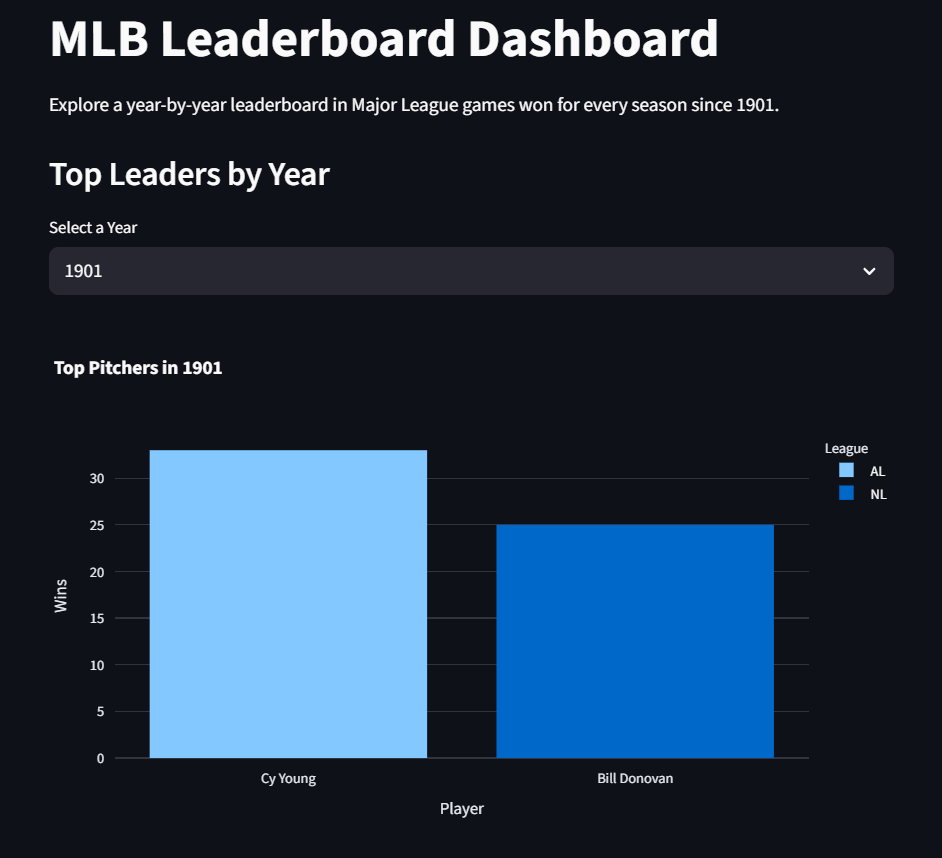

# MLB Wins Leaderboard Dashboard

This project is a data analysis and visualization capstone that scrapes, cleans, stores, queries, and visualizes historical MLB pitcher win leaders from 1901 to 2025.

The data is scraped using Selenium from Baseball Almanac, cleaned with pandas, stored in SQLite, and queried using both a command-line interface and an interactive Streamlit dashboard. Users can explore leader trends by year, league, team, or player, and visualize the results through various dynamic charts.

---

## Dashboard Preview

[ Click here to launch the dashboard](https://capstoneproject-ovapprkln5zkzjxybdguo9c.streamlit.app/)



---

## Setup Instructions

### 1. Clone the Repository
```bash
git clone https://github.com/your-username/Capstone_Project.git
cd Capstone_Project
```

### 2. Install Required Packages
```bash
pip install -r requirements.txt
```

### 3. Run the Streamlit Dashboard
```bash
streamlit run p4_streamlit_dashboard.py
```

### 4. (Optional) Run the CLI Query Tool
```bash
python p3_database_query.py
```

---


